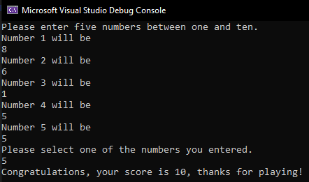
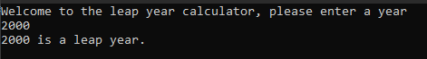
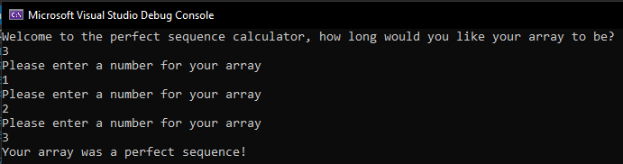
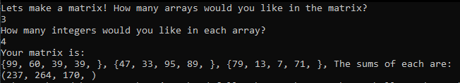

# ASP.NET Prep Data Structures and Algorithms Challenges

## Array Max Result

### Task

Given an array select a number that exists, and output the computated "score". The method you create should take in both an array of integers and the integer the user selected.

Create a Console application that requests 5 numbers between 1-10 from the user. Output the array to the console and ask the user to select a number. After the selection, output the "score" of the number chosen.

### Screenshot

## Leap Year Calculator

### Task

Given a year, report if it a leap year.

### Screenshot

## Perfect Sequence

### Task

Given an array, return "Yes" if the sequence is considered a perfect sequence. Otherwise, return "No".

### Screenshot

## Sum of Rows

### Task

Given a matrix of integers, return the sum of each row in a single dimensional array.

### Screenshot

